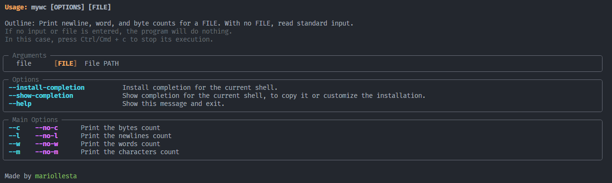

<p align="center">
<em>Writting my own wc Unix tool</em>
</p>


---

## About

Following the guidelines of the [Coding Challenges blog](https://codingchallenges.fyi/), the goal of this project is the development of a proprietary version of the Unix command line tool wc.

The wc command is used to count the number of lines, words and bytes in a text file passed as a parameter. On the other hand, if no text file is specified, the command will read from the standard input.

> Give me a star if you find it useful :)

---

## Requirements

[](https://python.org)
[](https://pypi.org/project/pip/)


---

## Set up

Download the application repository:

```terminal
git clone https://github.com/mariollesta/my-own-wc.git
```

> Note: It will be downloaded to the directory where we are located in our terminal by executing the command

Install the packages:

- To install the package locally in the user's directory, which means that it will only be available to the user who performed the installation

```terminal
pip install --user <PATH>/mywc-<version>-py3-none-any.whl
```

- To install the package globally on the system, which means that it will be available to all users on the system. May require elevated (administrative) permissions to install the package.

```terminal
pip install <PATH>/mywc-<version>-py3-none-any.whl
```

> Note: If the program does not work, check that the directory where the executable is located is in the PATH variable of the system.

---

## How to use

You can use the attached file in the repository "test.txt" to test the operation of the application.

To see the operation and options of the program, we run it with the help option:

```terminal
mywc --help
```

You will see something like what is shown in the following image:



In this way, you will be able to see how the tool works as well as the options available to you.

Afterwards, 

if you want to know the number of bytes in a file, you would execute the command:

```terminal
mywc --c <PATH to FILE> 
```

if you want to know the number of lines:

```terminal
mywc --l <PATH to FILE> 
```

if you want to know the number of words: 

```terminal
mywc --w <PATH to FILE>
```

if you want to know the number of charecters:

```terminal
mywc --m <PATH to FILE>
```

Finally, if no options are provided, it is the equivalent to the -c, -l and -w options. 

```terminal
mywc --m <PATH to FILE>
```

In addition, as the help shows, if no file is provided, it will try to read from the standard input. So, if we wanted to count the bytes of a file by reading from the standard input we could do it as follows:

```terminal
cat <PATH to FILE> | mywc --m 
```

---
